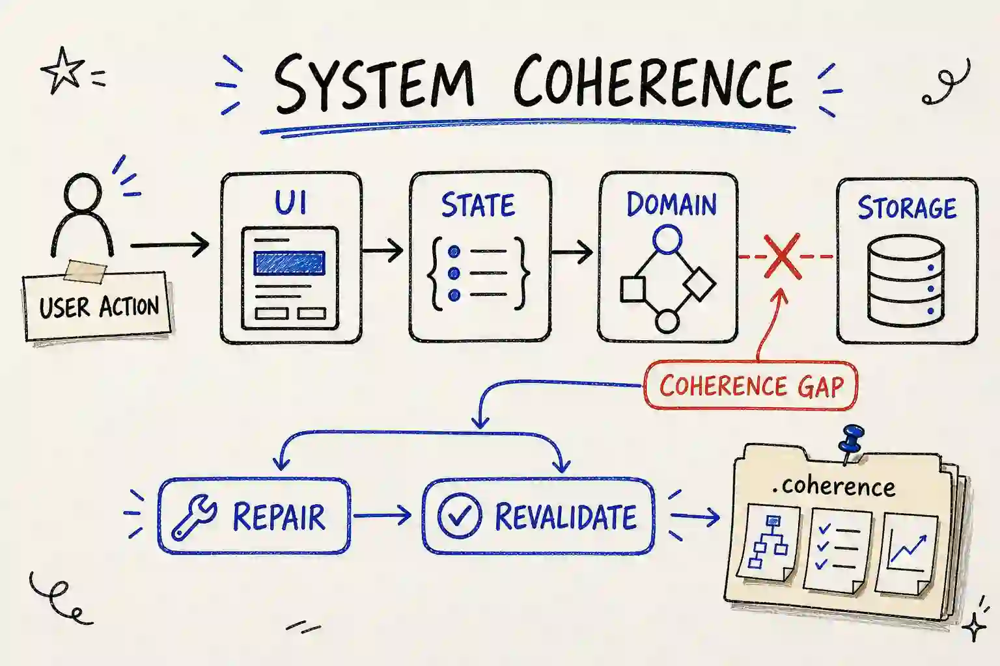
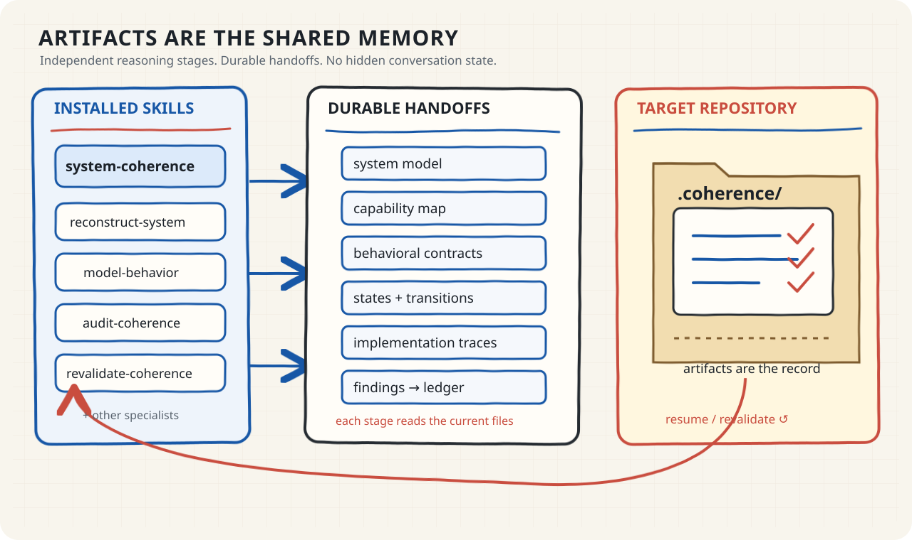

# System Coherence

Most coding agents inspect files. **System Coherence reconstructs how the
software is supposed to behave—then checks whether the layers agree.**

It is an installable collection of 10 Agent Skills for finding the gaps that
ordinary tests and local code review can miss: stale derived state, broken
recovery, partial commits, unrepresented states, races, and behavior that
drifts across the interface, domain, persistence, and external boundaries.



## The core idea

System Coherence follows behavior end to end:

```text
reconstruct the system
        ↓
discover capabilities → write behavioral contracts → model states
        ↓                         ↓                       ↓
             trace the real implementation
                              ↓
                      find coherence gaps
                              ↓
                    repair → revalidate → remember
```

It does not replace tests. Tests ask whether code satisfies written
expectations. System Coherence asks whether the expectations, states,
transitions, failure paths, and cross-layer consequences have been correctly
reconstructed in the first place.

## Install in 30 seconds

The Agent Skills collection is the primary product. The Python package below
is optional development and evaluation infrastructure; it is not required to
install or use the skills.

### Recommended: install the complete collection

From the repository you want to audit, use the canonical public GitHub URL for
the published System Coherence repository:

```bash
npx skills add "https://github.com/MPSMeridiaN/Auditor" --skill '*' --copy --yes
```

Use that URL verbatim; do not guess another owner or use a private development
path. The release remote is the source of truth for the published suite. The
same command shape installs all 10 skills. `--copy` makes the target
self-contained; the source checkout does not need to remain available after
installation.

`npx skills` uses its configured agent destinations. Run the command from the
target project for project-local scope. If the harness should receive the
skill in only one agent, add `--agent <host-agent-id>` using the identifier
reported by that harness. For a user-wide installation, target the requested
agent explicitly and add `--global`:

```bash
npx skills add "https://github.com/MPSMeridiaN/Auditor" --skill '*' --agent <host-agent-id> --copy --global --yes
```

Do not hardcode an agent's skills directory when the host already provides a
native installer or discovery mechanism. If the CLI is not available, use the
host's documented native installation path and preserve the direct-child skill
layout. The portable runtime boundary is each skill's `SKILL.md` plus any
resources below that skill; the target project owns `.coherence/`.

### Install with your AI agent

Give your coding agent this repository URL and ask it:

```text
Install the System Coherence skill suite from https://github.com/MPSMeridiaN/Auditor.
Inspect the current harness, use its native Agent Skills installer when one is
available, otherwise use a compatible Agent Skills installer. List the
repository's available skills, install the complete suite in the requested
project or global scope, verify every required skill and bundled reference is
discoverable without the source checkout, then invoke `system-coherence` on
this project. Do not invent a custom skills directory.
```

The full collection is the normal path because `system-coherence` orchestrates
the other nine skills. Installing one specialist is supported only for an
intentionally focused stage or an already-populated artifact workspace.

For a focused specialist, install only that skill:

```bash
npx skills add "https://github.com/MPSMeridiaN/Auditor" --skill audit-coherence --copy --yes
```

Use the complete collection for a new end-to-end audit. A focused install does
not provide the companion skills needed for normal orchestration.

To test a release before it has a public URL, use a clean clone of the exact
release tree as the source:

```bash
npx skills add /absolute/path/to/cloned/system-coherence --skill '*' --copy --yes
```

### Manual alternative

If no compatible installer exists, follow the target harness's documented
manual installation method. Preserve the direct-child layout and keep
`system-coherence/references/` beside its `SKILL.md`:

```text
target-repository/
└── <host-defined skills directory>/
    ├── system-coherence/SKILL.md
    ├── system-coherence/references/...
    └── <other-skill>/SKILL.md
```

There is no custom manifest and no Python dependency in the installed skill
collection. Each skill is independently discoverable by its `SKILL.md`; the
complete suite is required for the orchestrator's end-to-end route.

### Receive updates

When the installer records the source, update a project-local installation
with:

```bash
npx skills update --project --yes
```

For a global installation, use `npx skills update --global --yes`. If the
selected host does not support update, repeat the complete install command
with the new repository revision. Installation updates replace methodology
files only; `.coherence/` remains target-project state and must be preserved.

## First invocation

Invoke the `system-coherence` skill with the target repository in scope. A
natural-language request is enough:

```text
Run a System Coherence audit of this repository. Start from the current
.coherence state if one exists, otherwise initialize it. Continue through the
available stages, preserve evidence for every conclusion, and tell me the
next safe step when a handoff is incomplete.
```

The orchestrator is the obvious entry point. It reads the current snapshots,
selects exactly one next stage, and hands off through files rather than hidden
conversation context. If the audit is interrupted, invoke the same skill
again; it resumes from the target repository's current artifacts.

## What happens when you run it?

1. The agent captures repository evidence and reconstructs the product's
   boundaries, authorities, resources, and observable interfaces.
2. It groups entry points into capabilities, writes behavioral contracts, and
   models reachable states, transitions, recovery, and uncertainty.
3. It traces those contracts into source code, tests, runtime observations,
   persistence, and external effects.
4. It challenges the transitions that are easiest to get wrong: retries,
   duplicate actions, cancellation, restart, partial failure, concurrency,
   stale views, and external changes.
5. It records evidence-backed findings and acceptance-driven remediation.
6. After changes, it computes the smallest safe revalidation scope and
   refreshes the Coherence Ledger.

The result is not just a chat transcript. It is a durable, inspectable
behavioral memory owned by the target repository.

## Artifacts are the shared memory

The installed skills communicate through `.coherence/` in the target project.
The files—not the previous conversation—are the shared memory:



```text
target-repository/
└── .coherence/
    ├── config.json
    ├── session.json
    ├── evidence/
    ├── artifacts/
    │   ├── repository-evidence.json
    │   ├── system-model.json
    │   ├── capability-map.json
    │   ├── behavioral-contracts.json
    │   ├── state-model.json
    │   ├── implementation-traces.json
    │   ├── audit-findings.json
    │   ├── intervention-plan.json
    │   ├── regression-scope.json
    │   ├── revalidation-results.json
    │   └── coherence-ledger.json
    ├── history/
    └── tmp/
```

This is the target repository's persistent behavioral memory. It does not
belong to the installed skill package. Every handoff carries a source
revision, evidence references, uncertainty, freshness, and links to the
artifacts it consumed.

## A small coherence gap

Consider a workspace manager:

```text
workspace registered
        ↓
folder deleted externally
        ↓
application still shows the workspace
        ↓
delete action can no longer complete
```

System Coherence turns that observation into a cross-layer question:

```text
Capability:        workspace lifecycle
Missing state:     registered-but-missing
Broken transition: external deletion → reconciliation
Finding:           UI, registry, and filesystem no longer describe one reality
```

This is the kind of lifecycle defect represented by the included
[`web-cache-staleness` fixture](examples/web-cache/README.md): the database
changes, but a derived cache continues to report the deleted object.

## Why not just tests?

| Practice | Primary question |
| --- | --- |
| Tests | Does the implementation satisfy the expectations we wrote down? |
| Static analysis | Does the code have known structural or type-level problems? |
| Code review | Does the change make sense to another engineer? |
| Test generation | Which additional inputs might exercise the implementation? |
| System Coherence | Did we reconstruct the right capabilities, contracts, states, transitions, failure paths, and cross-layer consequences? |

The practices complement one another. System Coherence is especially useful
when correctness is distributed across UI state, domain logic, storage,
workers, external systems, recovery, and derived views.

## The skill suite

| Skill | Responsibility | Durable output |
| --- | --- | --- |
| `system-coherence` | Route, resume, validate, and summarize | Evidence / ledger |
| `reconstruct-system` | Discover boundaries, components, resources, and authorities | System model |
| `discover-capabilities` | Group entry points into end-to-end capabilities | Capability map |
| `model-behavior` | Define intended contracts and invariants | Behavioral contracts |
| `model-states` | Model states, transitions, recovery, and unknown states | State model |
| `trace-implementation` | Link behavior to source, runtime, and test evidence | Implementation traces |
| `audit-coherence` | Check cross-layer consistency, races, and orphan transitions | Audit findings |
| `plan-remediation` | Turn findings into acceptance-driven actions | Intervention plan |
| `analyze-regression` | Map changes to affected verification scope | Regression scope |
| `revalidate-coherence` | Verify affected behavior before the ledger refresh | Validation results |

Each skill has its own trigger, inputs, completion criteria, uncertainty
behavior, and next transitions. The orchestrator routes from current files,
not from assumptions about the last session.

## Supported workflows

- **New audit:** install the collection and invoke `system-coherence`.
- **Resume:** invoke the same skill; it reads `.coherence/artifacts/` and
  routes to the first incomplete or stale handoff.
- **Change-focused verification:** run the regression stage for changed paths,
  revalidate the affected contracts, and refresh the ledger.
- **Protocol inspection:** use the optional verifier to validate envelopes,
  references, freshness, and route decisions deterministically.

## Optional development verifier

For contributors and deterministic local checks, install the standard-library
verifier from a source checkout (Python 3.11+):

```bash
python -m pip install -e .
coherence init /path/to/target
coherence status --json /path/to/target
coherence route --json /path/to/target
```

After an implementation change, calculate scoped invalidation and inspect the
ledger:

```bash
coherence capture /path/to/target
coherence invalidate /path/to/target src/path/to/changed_file.py
coherence ledger --json /path/to/target
```

The commands mutate only the target's `.coherence/` workspace. The verifier
does not install the Agent Skills collection; the `skills/` tree remains the
portable runtime surface.

## Examples and checks

The repository includes three executable fixtures:

- [`web-cache`](examples/web-cache/README.md) — stale derived state after
  deletion;
- [`worker-service`](examples/worker-service/README.md) — completion persisted
  before a side effect;
- [`clean-cli`](examples/clean-cli/README.md) — a correct rename as a negative
  control.

Run the deterministic checks from a source checkout:

```bash
python -m unittest discover -s tests -v
coherence validate-skills --json .
coherence eval --json .
```

The fixture suite currently detects the two documented lifecycle defects and
does not over-report the negative control. Host-agent instruction-following
evaluations remain a separate integration concern.

## Documentation

- [AI Agent Installation Contract](AGENTS.md) — URL-only discovery,
  installation, verification, and invocation guidance.
- [Getting started](docs/getting-started.md) — installation and first workflow.
- [Architecture](docs/architecture.md) — runtime components and stage
  boundaries.
- [Methodology](docs/methodology.md) — behavioral reconstruction and audit
  method.
- [Artifact protocol](skills/system-coherence/references/artifact-protocol.md)
  — authoritative envelope and payload contract.
- [Extension guide](docs/extension-guide.md) — add skills, artifact fields, and
  adapters.
- [Evaluation methodology](docs/evaluation.md) — fixtures, probes, and limits.
- [Contributing](CONTRIBUTING.md) — tests and release hygiene.

## Limitations

System Coherence cannot infer product intent with certainty, access external
systems that are unavailable to the agent, or guarantee that every behavior
was discovered. It makes those limits explicit through evidence references,
uncertainty entries, partial or blocked status, and conservative invalidation.
A valid artifact graph proves protocol integrity, not behavioral correctness
by itself.

## License

MIT. See [LICENSE](LICENSE).
