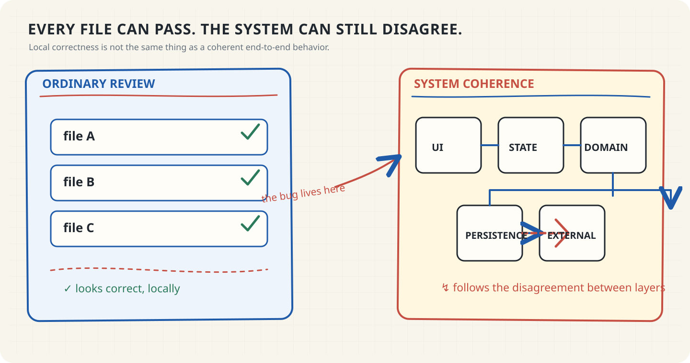
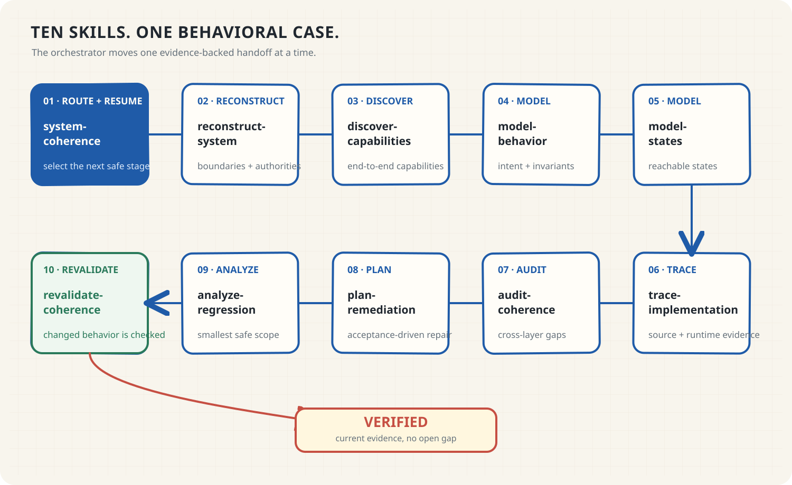
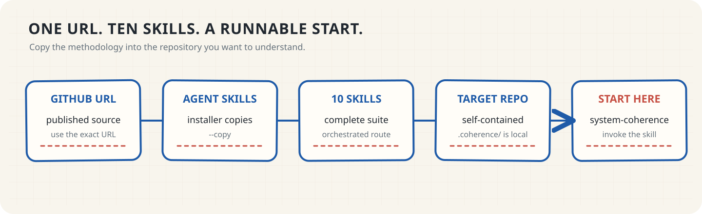
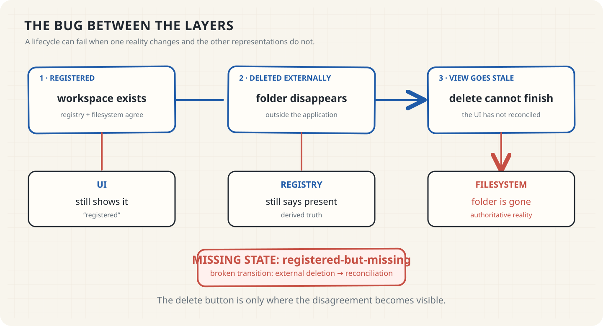
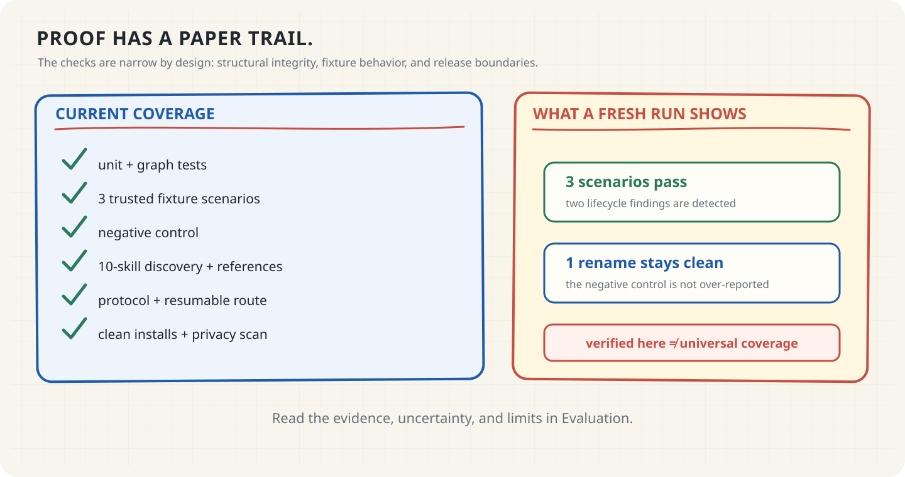

# System Coherence

> **Audit the system, not the files.**
>
> Most coding agents inspect files in isolation. **System Coherence reconstructs
> how behavior should work, then checks whether the layers still agree.**
>
> *Find the bugs between the layers.*

[Install the complete suite](#install) · [See the methodology](docs/methodology.md) · [Explore the docs](#explore)

## Why ordinary review misses the bug

A file can be correct and a test can be green while the UI, state, domain,
persistence, workers, or external systems disagree.

## How the suite works

The ten Agent Skills turn an unfamiliar codebase into an evidence-backed
behavioral case, one handoff at a time.

<code>system-coherence</code> routes the next stage from the current artifacts.
Specialists record evidence, uncertainty, freshness, and the next safe
transition.

## Install

Install the complete suite into the repository you want to audit:

~~~bash
npx skills add "https://github.com/MPSMeridiaN/Auditor" --skill '*' --copy --yes
~~~

Run it from the target repository. Or give this repository URL to your coding
agent and ask it to install the complete System Coherence suite.

### Start

Invoke <code>system-coherence</code> in the target repository:

> Run a System Coherence audit of this repository. Start from <code>.coherence</code>
> if it exists; otherwise initialize it. Preserve evidence for every conclusion
> and tell me the next safe step when a handoff is incomplete.

The optional Python <code>coherence</code> verifier supports contributor,
protocol, and release checks. It is not required by the installed skills.

[Advanced installation → Getting Started](docs/getting-started.md) · [AI Agent Installation Contract](AGENTS.md)

## Durable memory

**Agents can change. The behavioral memory stays.**

Each stage writes an inspectable artifact into <code>.coherence/</code>. If a
session stops, the next agent reads the current handoff and resumes from the
last valid stage.

## One coherence gap

Imagine a workspace that is registered, then deleted outside the application.
The UI and registry still say it exists; the filesystem says it does not.

**Missing state:** <code>registered-but-missing</code> · **Broken transition:** external deletion → reconciliation

The included <code>web-cache-staleness</code> [fixture](examples/web-cache/README.md)
is a runnable analogue: the database changes, but a derived cache keeps
reporting the deleted object.

## Proof / verification

The repository keeps a paper trail for structural checks, fixture behavior, and
release boundaries.

The checks are intentionally scoped: a passing artifact graph or fixture run
does not claim universal behavioral coverage. See [Evaluation](docs/evaluation.md)
for the evidence and limits.

## Explore

- [Getting Started](docs/getting-started.md) — install, start, resume, and inspect a target workspace.
- [Architecture](docs/architecture.md) — the skill collection and optional verifier boundaries.
- [Methodology](docs/methodology.md) — reconstruct behavior from the outside in.
- [Artifact Protocol](skills/system-coherence/references/artifact-protocol.md) — durable handoff envelopes and payloads.
- [Evaluation](docs/evaluation.md) — fixtures, probes, and interpretation.
- [Compatibility](docs/compatibility.md) — hosts, installers, Python, and operating systems.
- [Security](SECURITY.md) · [Contributing](CONTRIBUTING.md) · [Changelog](CHANGELOG.md)

## License

MIT. See [LICENSE](LICENSE).
